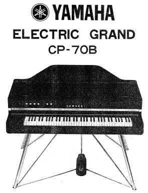
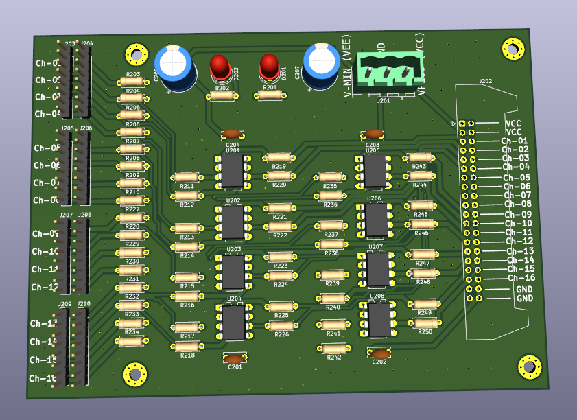

# Yamaha CP70 Electric Grand Piano - 72 Channel Pre-amplifier Project

https://www.pomeindhoven.nl/

Paviljoen Ongehoorde Muziek
Vestdijk 25 - 5611 CA
Eindhoven

## Project Overview

This repository contains the KiCad project files, documentation, and design decisions for a custom-built 72-channel pre-amplifier designed for a Yamaha CP70 electric grand piano. This project is an open-source initiative developed in collaboration with [Paviljoen Ongehoorde Muziek (POM)](https://www.pomeindhoven.nl/) in Eindhoven, Netherlands, as part of an art project.

The primary goal of this pre-amplifier is to individually buffer and potentially amplify the signals from each of the 72 string pickups of the CP70, providing a high-quality, low-noise output output signal for further amplification to 72 speakers.

**Repository URL:** [https://github.com/edwin-oetelaar/CP70_preamp/tree/main](https://github.com/edwin-oetelaar/CP70_preamp/tree/main)

## Image of the piano



## Background

The Yamaha CP70 is an iconic electric grand piano known for its unique sound, derived from real strings and hammers combined with a piezo pickup system.
This project aims to provide a modern, high-fidelity replacement, with 72 separate output channels as an alternative pre-amplifier system.

This pre-amp is designed with the following considerations:
*   **High Input Impedance:** To accurately capture the full tonal character of the CP70 pickups without loading them down.
*   **Low Noise Performance:** Essential for a clean signal, especially with 72 individual channels.
*   **Sufficient Headroom:** To handle the potentially large signal swings from the pickups.
*   **Individual Channel Processing:** Each pickup receives its own pre-amplifier stage.
*   **Modularity:** For ease of assembly, testing, and maintenance.
*   **Open Source:** All design files and documentation are publicly available to encourage learning, modification, accessibility.

## Project Status

[ **TODO: Update this section regularly, e.g., In Design, Prototyping, Tested, In Use** ]

*   Current Version: [e.g., v0.1 - Initial Design]
*   Key Milestones:
    *   [x] Initial schematic design complete.
    *   [x] PCB layout for [16]-channel module complete.
    *   [x] PCB ordered
    *   [x] parts ordered
    *   [ ] First prototype(s) built and tested.
    *   [ ] Full 72-channel system assembled.
    *   [ ] Integration with the CP70 at Paviljoen Ongehoorde Muziek.

## Design Files and Documentation

This repository is structured to include:

*   **/kicad_project:** Contains the KiCad schematic and PCB layout files.
    *   `CP70_preamp.kicad_pro` - Main KiCad project file.
    *   `CP70_preamp.kicad_sch` - Main schematic file.
    *   `CP70_preamp.kicad_pcb` - Main PCB layout file (or individual module files).
    *   `libraries/` - Custom schematic symbols and PCB footprints, if any.
    *   `out1/` - Gerber files for PCB manufacturing (to be added when ready). (file out1.zip sent to JLCPCB)
    *   `bom/` - Bill of Materials (to be added).
*   **/documentation:**
    *   `design_decisions.md` - Detailed explanation of the design choices, component selection, and rationale.
    *   `specifications.md` - Target specifications for the pre-amplifier.
    *   `testing_procedure.md` - (To be added) How to test individual modules and the full system.
    *   Images, block diagrams, and other supporting documents.
*   **/images:** Schematics, photos of prototypes, etc.
*   `README.md` - This file.

# image of version 0.1 printed circuit board



## Key Design Aspects (Summary)

*   **Number of Channels:** 72 (one for each pickup)
*   **Input Stage:** High-impedance buffer for each channel.
    *   Target Input Impedance: 470K Ω
    *   Expected Pickup Output: Up to 45V peak-to-peak in 1 M (requiring input attenuation).
*   **Operational Amplifier:** [e.g., TL072 or similar, specify your choice and link to design_decisions.md]
*   **Power Supply:** Symmetrical (e.g., +/-15V or +/-18V)
*   **Gain:** [e.g., Unity gain buffer, or variable gain via potentiometer - specify and link to design_decisions.md]

More detailed information on architecture, component choices, and trade-offs can be found in `/documentation/design_decisions.md`.

## Getting Started / How to Use

1.  **Clone the repository:**
    ```bash
    git clone https://github.com/edwin-oetelaar/CP70_preamp.git
    cd CP70_preamp
    ```
2.  **Open in KiCad:** Open the `CP70_preamp.kicad_pro` file in KiCad (Latest version).
3.  **Review Schematics and PCB Layout:** Explore the design in the KiCad schematic editor and PCB editor.
4.  **Check Documentation:** Read through the `design_decisions.md` and other documents for a deeper understanding.

## Contributing

This is an open-source project, and contributions or suggestions are welcome! If you have ideas, find bugs, or want to contribute to the design:

1.  **Fork the repository.**
2.  **Create a new branch** for your feature or bug fix.
3.  **Make your changes.**
4.  **Submit a Pull Request** with a clear description of your changes.

You can also open an [Issue](https://github.com/edwin-oetelaar/CP70_preamp/issues) to report bugs or suggest improvements.

## Collaboration

This project is in proud collaboration with:

**Paviljoen Ongehoorde Muziek (POM)**
Vestdijk 25 - 5611 CA Eindhoven
[https://www.pomeindhoven.nl/](https://www.pomeindhoven.nl/)

The pre-amplifier is intended for use in an art project hosted at POM.

## License

This project is licensed under the [MIT License](LICENSE.md) - see the LICENSE.md file for details.

## Contact

For questions or discussions regarding this project, you can contact:
*   Edwin van den Oetelaar - Leave a message in the issue tracker or google my name/email 
*   Or open an issue on this GitHub repository.
