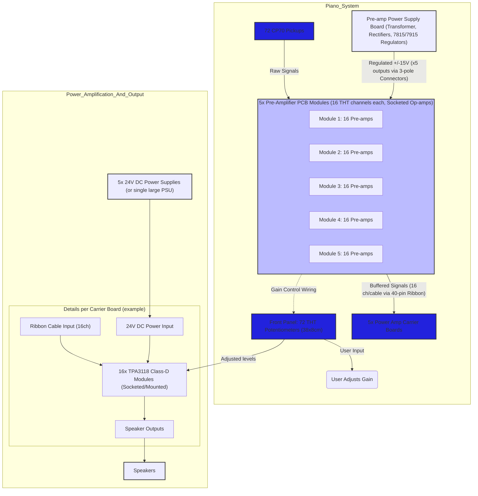

# Design Decisions for the CP70 72-Channel Pre-amplifier

**by : Edwin van den Oetelaar**

This document outlines the key design decisions made during the development of the 72-channel pre-amplifier and associated power amplification for the Yamaha CP70 electric grand piano.

## Table of Contents

- [Design Decisions for the CP70 72-Channel Pre-amplifier](#design-decisions-for-the-cp70-72-channel-pre-amplifier)
  - [Table of Contents](#table-of-contents)
  - [1. Overall System Architecture](#1-overall-system-architecture)
  - [2. Pre-amplifier Design Philosophy: Serviceability and Technology Choice](#2-pre-amplifier-design-philosophy-serviceability-and-technology-choice)
  - [3. Pre-amplifier Modularity and Channel Distribution](#3-pre-amplifier-modularity-and-channel-distribution)
  - [4. Front Panel Potentiometer Integration](#4-front-panel-potentiometer-integration)
  - [5. Pre-amplifier Interconnects and Signal Cabling](#5-pre-amplifier-interconnects-and-signal-cabling)
  - [6. Pre-amplifier Power Supply System](#6-pre-amplifier-power-supply-system)
  - [7. Power Amplification Stage](#7-power-amplification-stage)
  - [8. Pre-amplifier Circuit Design (Per Channel)](#8-pre-amplifier-circuit-design-per-channel)
  - [9. Component Selection (Pre-amplifier)](#9-component-selection-pre-amplifier)
  - [System Block Diagram (Mermaid JS - Updated)](#system-block-diagram-mermaid-js---updated)

---

## 1. Overall System Architecture

The system comprises several key stages:
1.  **Pickup Interface:** 72 individual pickups from the Yamaha CP70.
2.  **Pre-amplification:** 72 dedicated pre-amplifier channels to buffer, (optionally) amplify, and provide gain control for each pickup.
3.  **Signal Output:** Buffered signals from the pre-amplifiers are routed out of the piano.
4.  **Power Amplification:** Off-the-shelf Class-D amplifier modules to drive speakers (details below).
5.  **Power Supplies:** Separate, dedicated power supply systems for the pre-amplifiers and power amplifiers.

## 2. Pre-amplifier Design Philosophy: Serviceability and Technology Choice

A core principle for the pre-amplifier design is **serviceability and repairability using standard tools and readily available components.**

*   **Technology Choice:** Through-Hole Technology (THT) will be used exclusively for the pre-amplifier PCBs. This includes THT resistors, capacitors, and IC sockets.
*   **Op-amp Sockets:** All operational amplifiers on the pre-amplifier boards will be socketed. This allows for easy replacement of op-amps without requiring specialized SMT rework equipment (like hot air stations or microscopes).
*   **PCB Material:** Standard double-sided FR4 PCB material will be used.
*   **Potentiometers:** THT potentiometers will be used for front-panel gain control.

This approach ensures that an electronics engineer or skilled technician with standard soldering equipment can maintain and repair the pre-amplifier system effectively.

## 3. Pre-amplifier Modularity and Channel Distribution

The 72 pre-amplifier channels will be distributed across **five (5) identical pre-amplifier Printed Circuit Board (PCB) modules.**

*   Each PCB module will host **sixteen (16) pre-amplifier channels.**
*   This results in a total of 5 modules * 16 channels/module = **80 available pre-amplifier channels.**
*   This provides **8 spare channels** for immediate replacement or future use.

## 4. Front Panel Potentiometer Integration

Individual gain control for each of the 72 active channels will be provided by THT potentiometers mounted on a front panel.

*   **Panel Dimensions:** Approximately 38 cm (width) x 8 cm (height).
*   **Potentiometer Count:** 80. (for each pre-amp channel)
*   **Connection:** Wiring from the potentiometers to the respective pre-amplifier channels on the PCB modules will be required.

## 5. Pre-amplifier Interconnects and Signal Cabling

**Output Signal Cabling (from Pre-amp Modules to External Interface):**

*   **Cable Type:** 40-pin IDC (Insulation-Displacement Connector) ribbon cables will be used *primarily for signal transport*.
*   **Distribution across 5 Cables:** Each of the 5 pre-amplifier modules will route its 16 output signals via one 40-pin ribbon cable.
    *   **Signal Allocation per Cable:** 16 channels * 2 wires/channel (signal + signal ground/return) = 32 wires.
    *   **Remaining Wires per 40-pin Cable:** 40 - 32 = 8 wires. These can be used for additional ground connections or left as spares, but **will not carry main power.**

## 6. Pre-amplifier Power Supply System

A dedicated, robust power supply system will provide symmetrical power (e.g., +/-15V) to the five pre-amplifier PCB modules.

*   **Power Supply Board:** A custom power supply PCB will be designed.
    *   **Technology:** Based on proven linear regulator technology: Transformer -> Diode Bridge Rectifier -> Bulk Filter Capacitors -> Multiple pairs of 7815 (+15V) and 7915 (-15V) linear voltage regulators.
    *   **Outputs:** The power supply board will provide multiple (at least 5, one for each pre-amp module) regulated +/-15V outputs. Each output will be capable of supplying one pre-amp module.
*   **Power Connectors to Pre-amp Modules:**
    *   **Type:** Standard industrial pluggable terminal block connectors.
    *   **Style:** 3-pole (for +Vcc, -Vee, AGND).
    *   **Pitch:** 5.08 mm (e.g., "Combicon" style or similar).
    *   Each pre-amplifier module PCB will have a corresponding 3-pole female connector to receive power.
*   **Rationale:** Separating power distribution from signal cables (ribbon cables) improves noise immunity and allows for more robust power delivery using appropriate gauge wires and connectors.

## 7. Power Amplification Stage

The power amplification stage will utilize off-the-shelf Class-D amplifier modules.

*   **Amplifier Module Choice:** "Chip Original TPA3118 60W DC 12V-24V" modules (commonly available from suppliers like AliExpress) will be purchased in bulk.
*   **Power Output:** Each module is rated for up to 60W (though actual output will depend on supply voltage and load).
*   **Power Supply for Amplifiers:**
    *   A separate 24V DC power supply system will be used for these Class-D modules.
    *   Considering the total power (estimated < 300W for all channels), this might be implemented as a single larger 24V supply or potentially **split into five (5) smaller, independent 24V DC power supplies**, one for each group of power amplifiers corresponding to a pre-amp module's outputs. This can offer better isolation and fault tolerance.
*   **Mounting/Integration Board for TPA3118 Modules:**
    *   To avoid messy point-to-point wiring to the numerous TPA3118 modules, a **custom "motherboard" or "carrier board" PCB** will be designed.
    *   This carrier board will provide:
        *   Sockets or designated mounting points for multiple TPA3118 modules (e.g., 16 per carrier board, aligning with the pre-amp module channel count).
        *   Input connectors to receive the buffered signals from the pre-amplifier ribbon cables.
        *   Output connectors for speakers.
        *   Power distribution and connectors for the 24V DC supply to each TPA3118 module.
    *   This approach significantly improves assembly neatness, reliability, and serviceability of the power amplifier stage.

## 8. Pre-amplifier Circuit Design (Per Channel)

*   [ Placeholder - Details of the THT op-amp circuit, input attenuation, gain stage, etc. ]*

## 9. Component Selection (Pre-amplifier)

*   **Op-amps:** Socketed, THT dual or quad op-amps (e.g., TL072/TL074 or modern equivalents with good audio performance and appropriate voltage ratings).
*   **Resistors:** THT, 1% metal film for signal path.
*   **Capacitors:** THT. Film capacitors for audio coupling (good bi-polar electrolithic caps were chosen), electrolytic/tantalum for power supply bulk filtering, ceramic for local IC decoupling.
*   **Potentiometers:** THT, panel mount, audio taper.
*   **Connectors:**
    *   Inputs from Pickups:  https://www.farnell.com/datasheets/2995445.pdf PCB Spring Type Terminal Blocks (2.54mm pitch)
    *   Outputs to Ribbon Cables: 40-pin IDC male headers on PCB.
    *   Power Input: 3-pole, 5.08mm pitch pluggable terminal block female connector on PCB.
*   [ Placeholder - Other specific components. Refer to Bill of Materials (BOM). ]*

---

## System Block Diagram (Mermaid JS - Updated)

